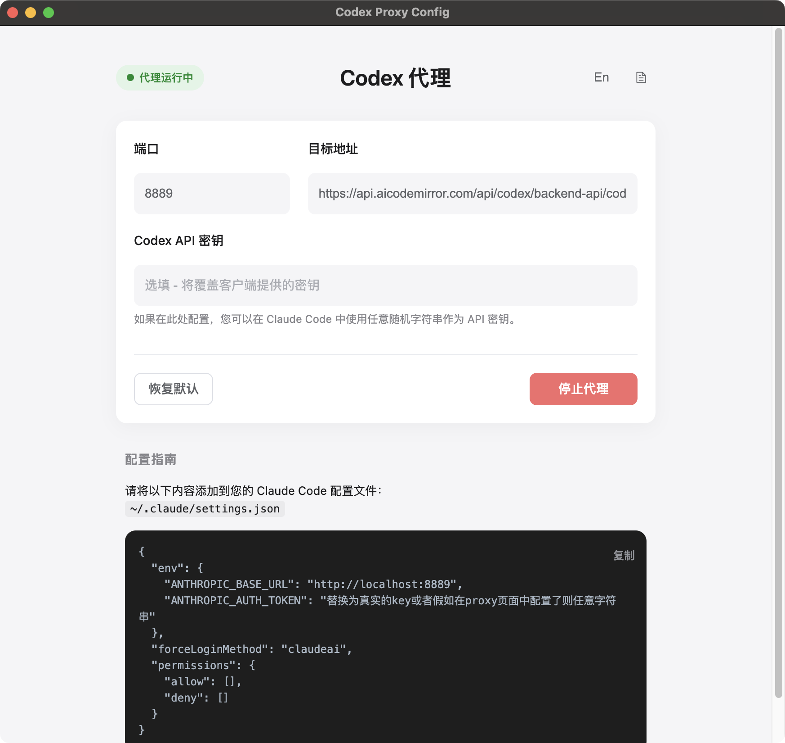

# Codex Proxy - Claude Code 中转代理

本项目专为 **Claude Code** 设计，将 Codex Responses API 格式转换为 Anthropic Messages API 格式，使 Claude Code 能够使用 aicodemirror 的 Codex API。



## 功能特性

✅ **完整功能支持**
- 文本对话流式响应
- 工具调用（以 Claude Code 传入的 tools 为准）
- 图片支持
- 推理强度配置（reasoning_effort）
- 工具结果反馈循环
- 桌面端安装包仅提供 macOS/Windows，Linux 请使用命令行启动

## 快速开始

### 使用桌面应用

从 [Releases](https://github.com/J1aDong/codexProxy/releases) 下载对应平台的安装包。

说明：Release 资产文件名可能不带版本号，请以 Release 标题/发布时间为准选择最新版本。

当前仅提供 macOS/Windows 安装包；Linux 暂无安装包，请使用命令行方式启动。

> **macOS 用户注意**：如果打开应用时提示"已损坏"，请在终端执行：
> ```bash
> xattr -cr /Applications/Codex\ Proxy.app
> ```

### 配置 Claude Code

Claude Code 配置文件路径：`~/.claude/settings.json`

```json
{
  "env": {
    "ANTHROPIC_BASE_URL": "http://localhost:8889",
    "ANTHROPIC_AUTH_TOKEN": "sk-ant-api03-你的API密钥"
  },
  "forceLoginMethod": "claudeai",
  "permissions": {
    "allow": [],
    "deny": []
  }
}
```

代理服务器默认监听 `http://localhost:8889`

## API 格式转换

### Anthropic Messages → Codex

| Anthropic 参数 | Codex 参数 | 说明 |
|---------------|-----------|------|
| `messages` | `input` | 消息内容 |
| `system` | `instructions` | 系统提示 |
| `tools` | `tools` | 工具定义 |

### 响应格式

```json
{
  "type": "content_block_delta",
  "delta": { "type": "text_delta", "text": "Hello!" },
  "index": 0
}
```

工具调用：
```json
{
  "type": "content_block_start",
  "content_block": {
    "type": "tool_use",
    "id": "tool_123",
    "name": "shell_command",
    "input": {}
  }
}
```

## 支持的工具

工具清单以 Claude Code 请求中的 `tools` 为准，代理不再自动注入 Codex 模板工具。若未传入 `tools`，则不会触发工具调用。

## 故障排除

### 问题：工具调用不触发

**原因**：工具定义格式不完整或未传入 tools

**解决**：确保 Claude Code 请求包含完整的 tools 定义

### 问题：图片无法识别

**原因**：图片 URL 格式不支持

**解决**：Claude Code 使用 `file://` 协议时，需要确保代理正确转换

### 问题：400 错误 "Instructions are not valid"

**原因**：instructions 格式不正确

**解决**：代理会自动使用 Codex CLI 的完整 instructions 模板

## API 端点

- **代理服务器**: `http://localhost:8889/v1/messages`
- **Codex API**: `https://api.aicodemirror.com/api/codex/backend-api/codex/responses`

## 许可证

本项目仅供学习和研究使用。

## 参考

- [Claude Code](https://docs.anthropic.com/en/docs/claude-code)
- [Codex CLI 源码](https://github.com/openai/codex)
- [aicodemirror](https://aicodemirror.com)
