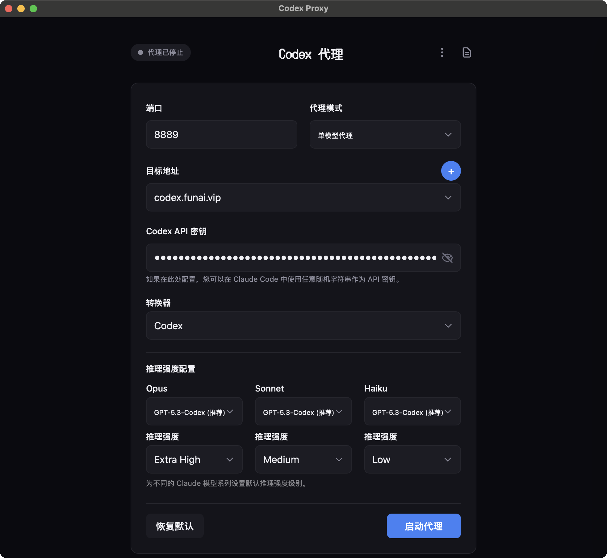
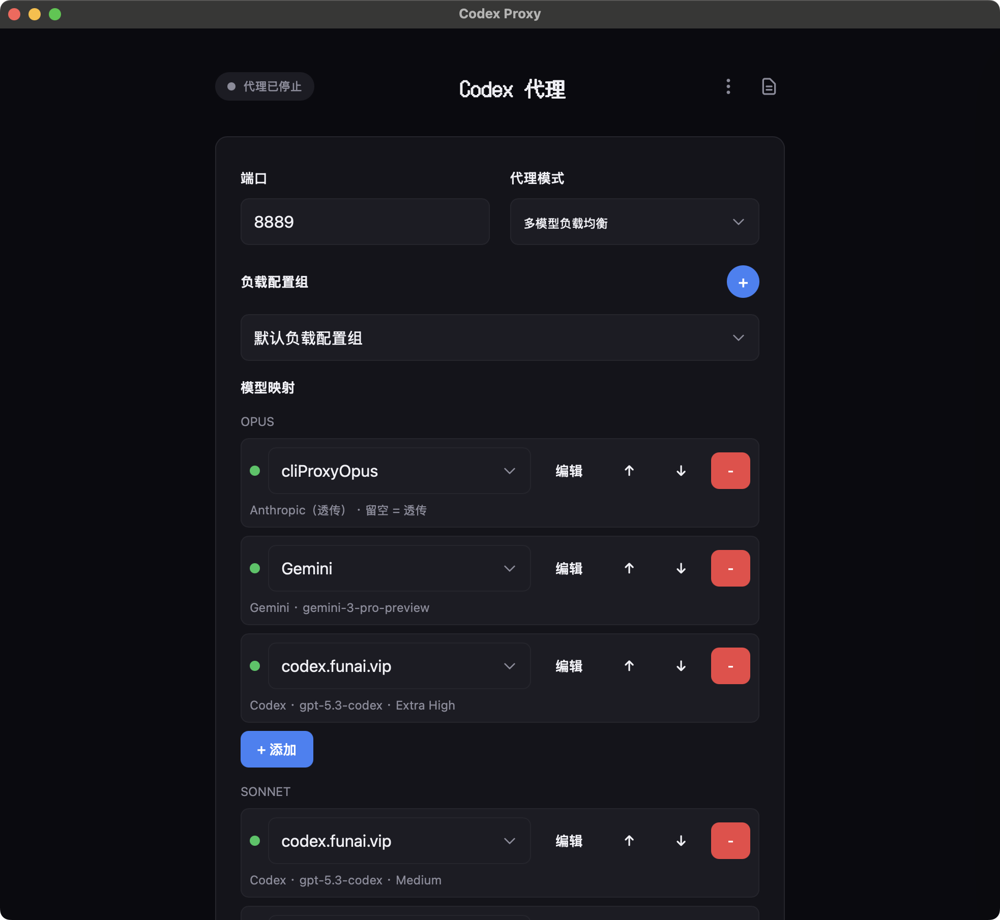

# Codex Proxy

Codex Proxy 是一个本地网关：以 **Anthropic Messages** 作为统一入口，兼容 **Claude Code** 使用习惯，并将请求稳定路由到 **Codex / Gemini / Anthropic（透传）** 等上游。

运行拓扑：

`Claude Code -> http://localhost:8889/v1/messages -> Codex Proxy -> (Codex/Gemini/Anthropic Upstream)`

## 核心能力

- 协议转换：`/v1/messages` 与 `/v1/messages/count_tokens`
- 流式转换：上游 SSE 统一回传为 Anthropic 事件格式
- 多上游支持：Codex、Gemini、Anthropic 透传
- 模型映射：按 `opus / sonnet / haiku` slot 做模型和推理强度映射
- 负载均衡：同 slot 多端点选择、健康状态管理、同请求内 failback
- 稳定性：`count_tokens` 失败可回退估算（可配置）、本地冷却、短退避
- 可运维性：配置热更新、请求/路由日志、配置导入导出、Tauri 可视化管理

## 界面截图

单模型模式：



多模型负载均衡模式：



## 快速开始

### 1. 桌面应用（推荐）

从 [Releases](https://github.com/J1aDong/codexProxy/releases) 下载安装包。

- 提供 macOS / Windows / Linux 安装包
- Linux 产物格式：`AppImage`、`DEB`、`RPM`

macOS 如提示“应用已损坏”，执行：

```bash
xattr -cr /Applications/Codex\ Proxy.app
```

### 2. 开发模式启动（Tauri）

```bash
git clone https://github.com/J1aDong/codexProxy.git
cd codexProxy/fronted-tauri
npm install
npm run tauri dev
```

### 3. 仅启动核心服务（Rust）

```bash
cd main
cargo run --bin codex-proxy-server
```

### 4. Linux 本地打包（可选）

在 Linux 主机上可直接打包 Tauri 安装包。以 Ubuntu 为例：

```bash
sudo apt-get update
sudo apt-get install -y \
  libwebkit2gtk-4.1-dev \
  libgtk-3-dev \
  libayatana-appindicator3-dev \
  librsvg2-dev \
  patchelf \
  rpm
```

```bash
cd fronted-tauri
npm install
npm run tauri build -- --bundles appimage,deb,rpm
```

## Claude Code 接入配置

Claude Code 配置文件：`~/.claude/settings.json`

```json
{
  "env": {
    "ANTHROPIC_BASE_URL": "http://localhost:8889",
    "ANTHROPIC_AUTH_TOKEN": "你的上游API密钥"
  },
  "forceLoginMethod": "claudeai",
  "permissions": {
    "allow": [],
    "deny": []
  }
}
```

本地代理默认监听 `http://localhost:8889`，常用入口：

- `POST /v1/messages`
- `POST /v1/messages/count_tokens`

## 代理工作流

1. 接收 `messages` 或 `count_tokens` 请求
2. 识别输入模型归属 slot（`opus / sonnet / haiku`）
3. 若启用负载均衡，在当前 slot 候选内选择端点
4. 按 `converter + operation` 解析上游 URL
5. 执行请求转换（tools、image、reasoning、model mapping）
6. 调用上游并将流式响应转换回 Anthropic SSE
7. 按返回状态更新端点健康（Healthy / Constrained / Cooldown）
8. 遇到可重试错误时，同请求内切换同 slot 下一个候选（failback）

## 配置与运行模式

### `single`（单模型代理）

- 使用当前选中的单个端点转发请求
- 适合单上游、低复杂度场景

### `load_balancer`（多模型负载均衡）

- 通过 profile 配置 `opus / sonnet / haiku` 到端点候选列表的映射
- 支持每端点策略：
  - `max_concurrency`
  - `error_threshold`
  - `cooldown_seconds`
  - `transient_backoff_seconds`

默认行为：负载切换 **不跨 slot**（例如 opus 不自动降到 sonnet/haiku）。

## 项目结构与关键入口

- `fronted-tauri/`：桌面前端（Vue）
- `fronted-tauri/src-tauri/`：Tauri 命令层（启动/停止、热更新配置、导入导出）
- `main/`：Rust 核心代理库与服务
- `backup/`：历史 Node.js 版本（归档参考）

关键排查入口：

- `main/src/server.rs`：HTTP 入口、请求生命周期、上游调用、SSE 回传
- `main/src/load_balancer/mod.rs`：slot 选择、健康状态、故障切换
- `main/src/transform/codex.rs`：Anthropic <-> Codex 转换
- `main/src/transform/gemini.rs`：Anthropic <-> Gemini 转换
- `main/src/transform/anthropic.rs`：Anthropic 透传
- `fronted-tauri/src-tauri/src/proxy.rs`：配置装载、运行时热更新、模式组装

## 常见问题

### 1. 负载均衡模式没有生效

常见原因：`load_balancer` 配置不完整（如未选 profile 或 profile 无有效端点映射）。  
结果：运行时会回退到单模型模式。

### 2. `count_tokens` 上游失败

当开启 `allowCountTokensFallbackEstimate` 时，代理会回退到本地估算；关闭后会直接返回上游错误。

### 3. 上游频繁报 401/403/429/404

- 401/403：优先检查 API Key 与权限
- 429：检查配额与限流，必要时增加端点并启用 LB
- 404（路由不可用）：会被识别为路由不可用信号并触发同 slot 快速切换

## 已知边界与约束

- 默认不跨 slot failover
- `codex-request.json` 模板指令仍是 Codex 路径的重要约束
- 主线实现是 Tauri + Rust，`backup/` 仅历史参考

## 参考

- [Claude Code 文档](https://docs.anthropic.com/en/docs/claude-code)
- [Anthropic Messages API](https://platform.claude.com/docs/en/api/messages)
- [OpenAI Codex 仓库](https://github.com/openai/codex)
- [API 格式参考（本仓）](docs/API-FORMAT-REFERENCE.md)
